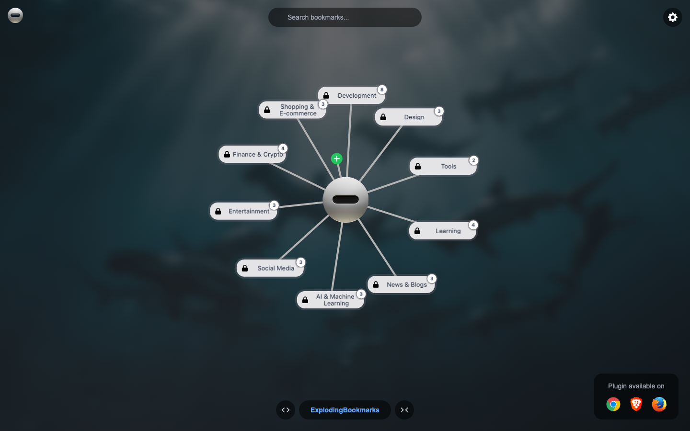
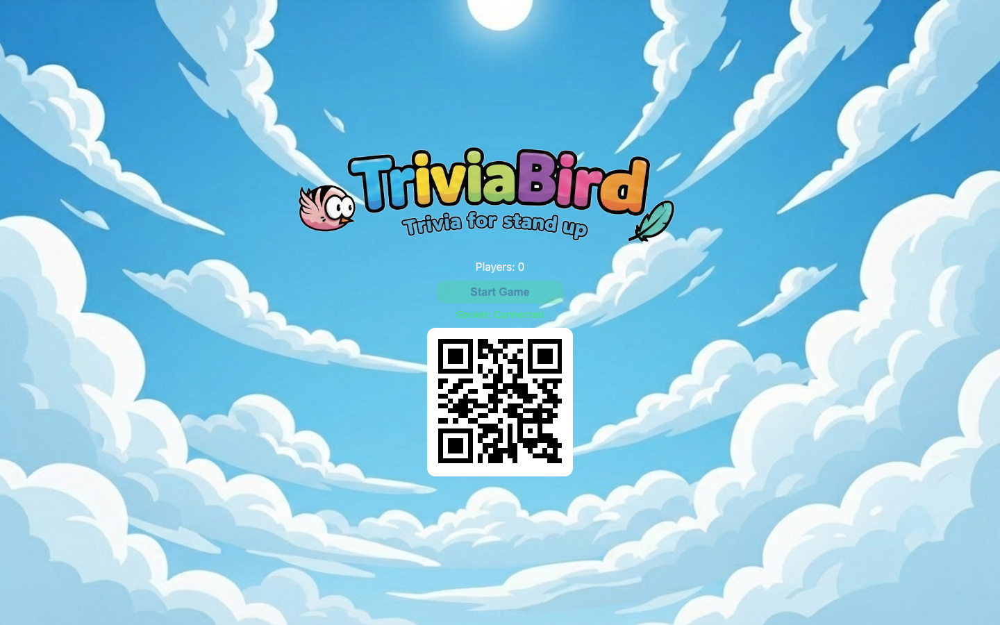
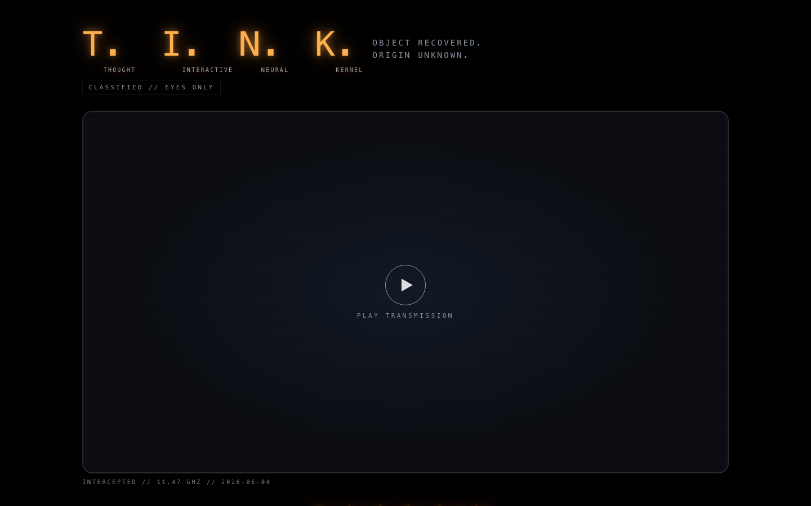

# Jesse Wallace: Portfolio 2026

Interactive web work: games, canvas rendering, physics, and AI-native tools.
15+ years shipping real-time interactive software · 41+ published web games · 2B+ plays

[GitHub](https://github.com/jjwallace) · [LinkedIn](https://linkedin.com/in/jjwallace)

---

## Exploding Bookmarks
**Live:** [explodingbookmarks.com](https://explodingbookmarks.com) · Browser extension (Chrome, Brave, Firefox) + standalone web demo

Your browser bookmarks as a full-screen, physics-based galaxy. Folders and links become a force-directed graph you can drag, zoom, search, and reorganize. Bookmarks you don't need get thrown at the wall and explode, with an undo timer before anything is deleted.

- **Rendering:** Phaser 3 canvas with D3-force physics, particle explosion effects, and glowing links with ambient bubbles flowing along them.
- **Architecture:** monorepo of reusable packages (effects, simulation, UI overlay) shared by the Chrome extension and the web demo.
- **Real data:** reads and writes your actual bookmarks through the Chrome Bookmarks API, with changes synced back in real time.
- **Privacy:** opt-in telemetry that never collects bookmark content.

**Why it matters:** browser bookmark managers haven't changed in decades. This turns a flat list into something people can see all at once and navigate spatially.

---

## Trivia Bird
**Live:** [triviabird.com](https://triviabird.com) · Source: [github.com/jjwallace/bird-trivia](https://github.com/jjwallace/bird-trivia)

A real-time multiplayer trivia game. Players scan a QR code, join from their phones, and compete live across 9 categories: animals, food, general knowledge, geography, history, movies, music, science, and space.

- **Real-time multiplayer:** Node backend with Socket.IO keeping every player in sync.
- **Game client:** Phaser 3 and React, with separate desktop (big screen) and mobile (controller) layouts.
- **Audio:** AI-generated sound effects built from prompts.

**Why it matters:** a complete multiplayer game, from server to client to audio, built and shipped by one person.

---

## T.I.N.K. (Thought Interactive Neural Kernel)
**Live:** [jjwallace.github.io/tink-site](https://jjwallace.github.io/tink-site/) · Source: [github.com/jjwallace/tink-site](https://github.com/jjwallace/tink-site)

A voice-and-overlay desktop companion for AI coding tools like Claude Code and Cursor. It listens to your editor and coding agents and turns their output into one calm spoken voice. "A more capable, less smug descendant of Clippy."

The landing site is a scroll-driven story in a PixiJS canvas:
- **Choreography:** three animated characters (a sphere, a glowing orb, and a tentacled creature) move in sync with scroll progress.
- **Physics:** Verlet-chain tentacle simulation for the creature.
- **Audio:** a Web Audio chirp synthesizer creates the creature's "voice" with no audio files, and Howler handles the sound effects.
- **Stack:** React, TypeScript, Vite, and Lenis smooth scrolling.

**Why it matters:** it shows an opinion on AI-assisted engineering (one calm voice instead of a noisy stream of agent output), presented through custom canvas animation and audio.
