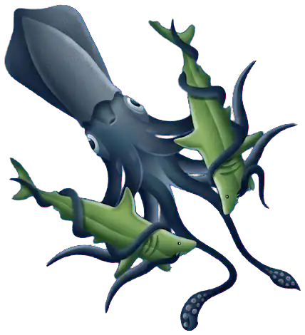
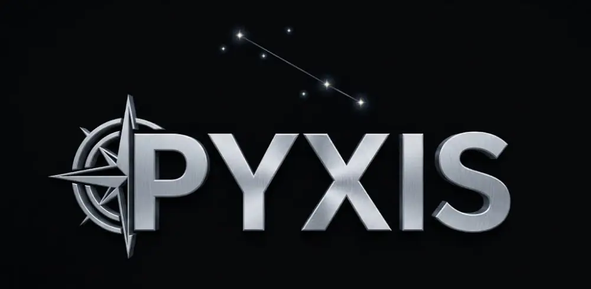

# Jesse Wallace: Portfolio 2026

Interactive web work: games, canvas rendering, physics, and AI-native tools.
15+ years shipping real-time interactive software · 41+ published web games · 2B+ plays

<a href="https://github.com/jjwallace">GitHub</a><a href="https://linkedin.com/in/jjwallace">LinkedIn</a>

Desktop app

## T.I.N.K. (Thought Interactive Neural Kernel)

<a href="https://hellotink.com/">Visit hellotink.com</a><a href="https://jjwallace.github.io/tink-site/">Landing demo</a>

A voice-and-overlay desktop companion for AI coding tools like Claude Code and Cursor. It listens to your editor and coding agents and turns their output into one calm spoken voice. "A more capable, less smug descendant of Clippy."

The landing site is a scroll-driven story in a PixiJS canvas:

- **Choreography:** three animated characters (a sphere, a glowing orb, and a tentacled creature) move in sync with scroll progress.
- **Physics:** Verlet-chain tentacle simulation for the creature.
- **Audio:** a Web Audio chirp synthesizer creates the creature's "voice" with no audio files, and Howler handles the sound effects.
- **Stack:** React, TypeScript, Vite, and Lenis smooth scrolling.

**Why it matters:** it shows an opinion on AI-assisted engineering (one calm voice instead of a noisy stream of agent output), presented through custom canvas animation and audio.

TypeScript library · AI tooling

## Pyxis

<a href="https://github.com/jjwallace/pyxis">Source</a>npm · TypeScript · Bun

A semantic router for code and docs. Pyxis indexes a codebase, its docs, rules and commands, then finds the right one by meaning instead of keywords, so a person or a coding agent can ask "how does auth work" and get the file and line. Named after the mariner's compass constellation.

- **Search:** real embeddings (Nomic Embed v2) with HNSW vector search, merged with BM25 full-text into one weighted hybrid score.
- **Code parsing:** the TypeScript Compiler API pulls out functions, classes, interfaces and types, each with a path:line reference; Rust is parsed too.
- **Speed:** the index persists to disk and loads instantly, updates incrementally when a file changes, and indexes in parallel.
- **Scope:** one unified index across multiple repos.

**Why it matters:** coding agents guess when they can't find the right file. Pyxis gives them, and people, a way to find code by what it does.

Browser extension

## Exploding Bookmarks

<a href="https://explodingbookmarks.com">Visit explodingbookmarks.com</a>Chrome · Brave · Firefox · Web demo

Your browser bookmarks as a full-screen, physics-based galaxy. Folders and links become a force-directed graph you can drag, zoom, search, and reorganize. Bookmarks you don't need get thrown at the wall and explode, with an undo timer before anything is deleted.

- **Rendering:** Phaser 3 canvas with D3-force physics, particle explosion effects, and glowing links with ambient bubbles flowing along them.
- **Architecture:** monorepo of reusable packages (effects, simulation, UI overlay) shared by the Chrome extension and the web demo.
- **Real data:** reads and writes your actual bookmarks through the Chrome Bookmarks API, with changes synced back in real time.
- **Privacy:** opt-in telemetry that never collects bookmark content.

**Why it matters:** browser bookmark managers haven't changed in decades. This turns a flat list into something people can see all at once and navigate spatially.

Multiplayer game

## Trivia Bird

<a href="https://triviabird.com">Play triviabird.com</a><a href="https://github.com/jjwallace/bird-trivia">Source</a>

A real-time multiplayer trivia game. Players scan a QR code, join from their phones, and compete live across 9 categories: animals, food, general knowledge, geography, history, movies, music, science, and space.

- **Real-time multiplayer:** Node backend with Socket.IO keeping every player in sync.
- **Game client:** Phaser 3 and React, with separate desktop (big screen) and mobile (controller) layouts.
- **Audio:** AI-generated sound effects built from prompts.

**Why it matters:** a complete multiplayer game, from server to client to audio, built and shipped by one person.

2008–2016 · Web games

## Older Projects

Commercial web games from 2008 to 2016, published by Nickelodeon, MTV, ArmorGames, MaxGames and others. Originally shown on [my earlier portfolio site](https://jjwallace.github.io/jjwallace-website/).

<h3>Gum Drop Hop</h3>

MaxGames · Designer, Animator, Programmer · 21 days

Non-violent platformer.

<a href="https://www.kongregate.com/en/games/jjwallace/gum-drop-hop" aria-label="Play Gum Drop Hop">Play</a>

<h3>Wonder Rocket</h3>

Nickelodeon · Designer, Animator, Programmer · 28 days

Upgrade-and-launch game.

<a href="https://www.kongregate.com/en/games/jjwallace/wonder-rocket" aria-label="Play Wonder Rocket">Play</a>

<h3>Iron Turtle</h3>

ArmorGames · Designer, Animator, Programmer · 21 days

Puzzle platformer featuring a robot turtle, with springs, coins and puzzles.

<a href="https://armorgames.com/play/4568/iron-turtle" aria-label="Play Iron Turtle">Play</a>

<h3>The Balls of Life</h3>

MTV / Nickelodeon · Designer, Animator, Programmer · 21 days

Platformer comedy game.

<a href="https://www.addictinggames.com/funny/balls-of-life" aria-label="Play The Balls of Life">Play</a>

<h3>Lost Fluid</h3>

Nickelodeon · Designer, Animator, Programmer · 21 days

Experimental discovery platformer: land on a distant planet and start life on it.

<a href="https://www.kongregate.com/en/games/jjwallace/lost-fluid" aria-label="Play Lost Fluid">Play</a>

<h3>Solar Ball</h3>

CoolBuddy · Designer, Animator, Programmer · 8 days

Physics puzzle game mixing pinball and pool.

<a href="https://www.kongregate.com/en/games/jjwallace/solar-ball" aria-label="Play Solar Ball">Play</a>

<h3>Bean Fiend</h3>

NextPlay · Designer, Animator, Programmer · 16 days

Platformer adventure game.

<a href="https://www.kongregate.com/en/games/jjwallace/bean-fiend" aria-label="Play Bean Fiend">Play</a>

<h3>Nog</h3>

CoolBuddy · Designer, Animator, Programmer · 14 days

Platformer with psychedelic themes.

<h3>The Slob</h3>

PlayHub · Designer, Animator, Programmer · 21 days

Platformer adventure game.

<h3>Red Lander</h3>

Mathfort · Designer, Animator, Programmer · 3 days

Experimental education game.

Brands and partners

## Corporate

Games built for brands and partners.

<h3>Law &amp; Order: Clue Hunter</h3>

Wolf Games · on Peacock

Puts Peacock viewers in the detective's seat: inspect crime scenes, identify suspects and close cases without leaving the app.

<a href="https://wolfgames.net">Wolf Games</a>

<h3>Bio Extract</h3>

US Army / FOX @ MRM//McCann · Programmer · 21 days

Tap/click strategy game (Angular, PhaserJS): isolate mind-controlling alien microbes. Used for microbiologist recruiting.

<h3>UAV</h3>

US Army / FOX @ MRM//McCann · Programmer · 28 days

Flight simulator (Angular, PhaserJS) with pseudo-3D mechanics built for canvas rendering. Sprites come from a recycled pool, then pan, rotate and scale for effects.

COPYRIGHT © 2026 JJWALLACE™

